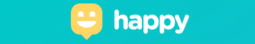

<p align="center"> 
  
  
  <a href="https://github.com/rafaelfachinelli">
    
  </a>
  
<p>

<p align="center">
 <a href="#computer-sobre">Sobre</a> •
 <a href="#memo-roteiro">Roteiro</a> •
 <a href="#triangular_ruler-status-do-projeto">Status</a> •
 <a href="#movie_camera-demonstração">Demonstração</a> •
 <a href="#dvd-executar-o-projeto">Executar</a> •
 <a href="#hammer-tecnologias">Tecnologias</a> •
 <a href="#boy-autor">Autor</a> •
 <a href="#page_facing_up-licença">Licença</a>
</p>

---
## :computer: Sobre

...

Projeto desenvolvido durante a **Next Level Week#3 (NLW)** na avançada **Trilha Omnistack** oferecida pela [Rocketseat](https://www.rocketseat.com.br).
O NLW é uma experiência online com muito conteúdo prático e desafios com duração de uma semana para conclusão.

---
## :memo: **Roteiro**

<div align="center">
<details>
<summary>Clique para Visualizar</summary>
	
<details>
<summary>WEB Responsivo</summary>

|      Estado      |     Plataforma   |     Tarefa    |
|      :---:       |       :---:      |      :---     |
|:heavy_check_mark:|:computer:        |Criar estrutura do projeto web com React|
|:heavy_check_mark:|:computer:        |Estruturar página inicial|
|:heavy_check_mark:|:computer:        |Estilizar página inicial|
|:heavy_check_mark:|:computer:        |Estruturar página de busca no mapa|
|:heavy_check_mark:|:computer:        |Estilizar página de busca no mapa|
|:heavy_check_mark:|:computer:        |Criar rotas no React|

</details>

<details>
<summary>Servidor</summary>
</details>

<details>
<summary>Aplicativo</summary>
</details>

</details>
</div>

---
## :triangular_ruler: **Status do Projeto**

<h4 align="center"> 
	👨‍🏫 Em desenvolvimento !
</h4>

---
## :movie_camera: **Demonstração**

<p align="center"><b> :computer: WEB DESKTOP </b></p>

<p align="center">
  <kbd>
    
  </kbd> 
</p>

<p align="center"><b> :iphone: WEB MOBILE </b></p>

<div align="center">

</div>

---
## :dvd: **Executar o Projeto**

### :desktop_computer: **WEB Responsivo**

Entre na pasta [`web/`](web/) e execute os seguintes comandos:

_com **npm**_

```bash
# Instalar dependências
$ npm install

# Iniciar servidor de desenvolvimento
$ npm start
```

_com **yarn**_

```bash
# Instalar dependências
$ yarn

# Iniciar servidor de desenvolvimento
$ yarn start

```

> ⚠️ O servidor de desenvolvimento iniciará na porta:3000 - Acesse <http://localhost:3000>

---
## :hammer: **Tecnologias**

As seguintes ferramentas foram utilizadas na construção do projeto:

<div align="center">

|WEB Responsivo|Servidor|Aplicativo|
|:---:|:---:|:---:|
|[HTML5](https://developer.mozilla.org/pt-BR/docs/Web/HTML/HTML5)|||
|[CSS3](https://developer.mozilla.org/pt-BR/docs/Archive/CSS3)|||
|[Typescript](https://www.typescriptlang.org)	|||
|[ReactJS](https://pt-br.reactjs.org)|||
|[React Router DOM](https://reactrouter.com/web/guides/quick-start)|||
|[React Icons](https://react-icons.github.io/react-icons/)|||
|[Leaflet](https://leafletjs.com)|||

</div>

---
## :boy: **Autor**

<div align="center">

<a href="https://github.com/rafaelfachinelli">
 
 <br />
 <sub><b>Rafael Fachinelli</b></sub></a>


Feito com ❤️ por Rafael Fachinelli 👋🏽 Entre em contato!

[](https://www.linkedin.com/in/rafaelfachinelli/)
[](https://github.com/rafaelfachinelli)
[](https://rafael-fachinelli.itch.io/)
[](mailto:rafael.fachinelli@fatec.sp.gov.br)

</div>

---
## :page_facing_up: **Licença**

<div align="center">

Copyright © 2020 [Rafael Fachinelli](https://github.com/rafaelfachinelli).<br />
Este projeto é licenciado pelo [MIT](./LICENSE).

</div>
