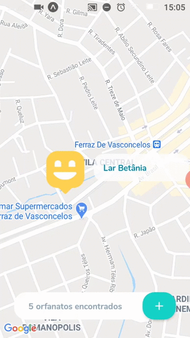

<div align="center">


</div>

<p align="center"> 
  
  
  <a href="https://github.com/rafaelfachinelli">
    
  </a>
  
<p>

<p align="center">
 <a href="#computer-sobre">Sobre</a> •
 <a href="#memo-roteiro">Roteiro</a> •
 <a href="#triangular_ruler-status-do-projeto">Status</a> •
 <a href="#movie_camera-demonstração">Demonstração</a> •
 <a href="#dvd-executar-o-projeto">Executar</a> •
 <a href="#hammer-tecnologias">Tecnologias</a> •
 <a href="#boy-autor">Autor</a> •
 <a href="#page_facing_up-licença">Licença</a>
</p>

---
## :computer: Sobre

Plataforma web, servidor e aplicativo mobile para cadastro e busca de orfanatos no mapa da região de Ferraz de Vasconcelos, São Paulo - Brasil.

Projeto desenvolvido durante a **Next Level Week#3 (NLW)** na avançada **Trilha Omnistack** oferecida pela [Rocketseat](https://www.rocketseat.com.br).
O NLW é uma experiência online com muito conteúdo prático e desafios com duração de uma semana para conclusão.

---
## :memo: **Roteiro**

<div align="center">
<details>
<summary>Clique para Visualizar</summary>
	
<details>
<summary>WEB Responsivo</summary>

|      Estado      |     Tarefa    |
|      :---:       |      :---     |
|:heavy_check_mark:|Criar estrutura do projeto web com React|
|:heavy_check_mark:|Estruturar página inicial|
|:heavy_check_mark:|Estilizar página inicial|
|:heavy_check_mark:|Estruturar página de busca no mapa|
|:heavy_check_mark:|Estilizar página de busca no mapa|
|:heavy_check_mark:|Criar rotas no React|
|:heavy_check_mark:|Finalizar página de busca no mapa|
|:heavy_check_mark:|Criar navegação entre páginas|
|:heavy_check_mark:|Abstrair componentes|
|:heavy_check_mark:|Conectar plataforma web com servidor|
|:heavy_check_mark:|Listar orfanatos no mapa|
|:heavy_check_mark:|Apresentação dos detalhes do orfanato|
|:heavy_check_mark:|Criação de orfanato|

</details>

<details>
<summary>Servidor</summary>

|      Estado      |     Tarefa    |
|      :---:       |      :---     |
|:heavy_check_mark:|Criar estrutura do servidor com Node.js|
|:heavy_check_mark:|Organizando rotas e parâmetros|
|:heavy_check_mark:|Criando tabelas no banco de dados|
|:heavy_check_mark:|Cadastro de orfanatos implementado|
|:heavy_check_mark:|Configurando controller|
|:heavy_check_mark:|Listagem de orfanatos|
|:heavy_check_mark:|Upload de imagens|
|:heavy_check_mark:|Desenvolvendo views|
|:heavy_check_mark:|Tratamento de excessões|
|:heavy_check_mark:|Validação de dados|

</details>

<details>
<summary>Aplicativo</summary>
	
|      Estado      |     Tarefa    |
|      :---:       |      :---     |
|:heavy_check_mark:|Criar estrutura do aplicativo com Expo|
|:heavy_check_mark:|Organizar projeto|
|:heavy_check_mark:|Criar rotas|
|:heavy_check_mark:|Criar componentes|
|:heavy_check_mark:|Criar páginas e estilos|
|:heavy_check_mark:|Navegação de páginas|
|:heavy_check_mark:|Integração com maps|
|:heavy_check_mark:|Integração com o servidor Node|

</details>
</details>
</div>

---
## :triangular_ruler: **Status do Projeto**

<h4 align="center"> 
	👶 Finalizado.
</h4>

---
## :movie_camera: **Demonstração**

<p align="center"><b> :computer: PLATAFORMA WEB </b></p>

<p align="center">
  <kbd>
    
  </kbd> 
</p>

<p align="center"><b> :iphone: APLICATIVO </b></p>

<p align="center">
  <kbd>
    
  </kbd> 
</p>

<div align="center">

</div>

---
## :dvd: **Executar o Projeto**

### :desktop_computer: **WEB Responsivo**

Entre na pasta [`web/`](web/) e execute os seguintes comandos:

<details>
<summary><i>com <b>npm</b></i></summary>

```bash
# Instalar dependências
$ npm install

# Iniciar servidor de desenvolvimento
$ npm start
```

</details>

<details>
<summary><i>com <b>yarn</b></i></summary>

```bash
# Instalar dependências
$ yarn

# Iniciar servidor de desenvolvimento
$ yarn start

```

</details>

> ⚠️ O servidor de desenvolvimento iniciará na porta:3000 - Acesse <http://localhost:3000>

### :globe_with_meridians: **Servidor**

Entre na pasta [`server/`](server/) e execute os seguintes comandos:

<details>
<summary><i>com <b>npm</b></i></summary>

```bash
# Instalar dependências
$ npm install

# Criar banco de dados
$ npm typeorm migration:run

# Iniciar servidor
$ npm dev
```

</details>

<details>
<summary><i>com <b>yarn</b></i></summary>

```bash
# Instalar dependências
$ yarn

# Criar banco de dados
$ yarn typeorm migration:run

# Iniciar servidor de desenvolvimento
$ yarn dev
```

</details>

> ⚠️ O servidor iniciará na porta:3333 - Acesse <http://localhost:3333>

> ⚠️ O Banco de Dados fica salvo em [`server/src/database/database.sqlite`](server/src/database/database.sqlite)

### :iphone: **Aplicativo**

Entre na pasta [`mobile/`](mobile/) e execute os seguintes comandos:

<details>
<summary><i>com <b>npm</b></i></summary>

```bash
# Instalar dependências
$ npm install

# Iniciar servidor de desenvolvimento
$ npm start
```

</details>

<details>
<summary><i>com <b>yarn</b></i></summary>

```bash
# Instalar dependências
$ yarn

# Iniciar servidor de desenvolvimento
$ yarn start

```

</details>

> ⚠️ O expo para desenvolvimento iniciará na porta:19002 - Acesse <http://localhost:19002>

> ⚠️ No arquivo **api.ts** dentro da pasta [`mobile/src/services/`](mobile/src/services/) é necessário colocar o seu IP local na variável baseURL, mantendo a porta 3333 do servidor.

---
## :hammer: **Tecnologias**

As seguintes ferramentas foram utilizadas na construção do projeto:

<div align="center">

|WEB Responsivo|Servidor|Aplicativo|
|:---:|:---:|:---:|
|[HTML5](https://developer.mozilla.org/pt-BR/docs/Web/HTML/HTML5)|[Node.js]()|[React Native](https://reactnative.dev)|
|[CSS3](https://developer.mozilla.org/pt-BR/docs/Archive/CSS3)|[Express]()|[React Navigation](https://reactnavigation.org)|
|[Typescript](https://www.typescriptlang.org)	|[SQLite3]()|[Expo](https://expo.io)|
|[ReactJS](https://pt-br.reactjs.org)|[Yup](https://github.com/jquense/yup)|[Axios](https://github.com/axios/axios)|
|[React Router DOM](https://reactrouter.com/web/guides/quick-start)|[TypeORM](https://typeorm.io)||
|[React Icons](https://react-icons.github.io/react-icons/)|||
|[Leaflet](https://leafletjs.com)|||
|[React Leaflet](https://react-leaflet.js.org)|||
|[Axios](https://github.com/axios/axios)|||

</div>

---
## :boy: **Autor**

<div align="center">

<a href="https://github.com/rafaelfachinelli">
 
 <br />
 <sub><b>Rafael Fachinelli</b></sub></a>


Feito com ❤️ por Rafael Fachinelli 👋🏽 Entre em contato!

[](https://www.linkedin.com/in/rafaelfachinelli/)
[](https://github.com/rafaelfachinelli)
[](https://rafael-fachinelli.itch.io/)
[](mailto:rafael.fachinelli@fatec.sp.gov.br)

</div>

---
## :page_facing_up: **Licença**

<div align="center">
  
[](./LICENSE)

</div>
